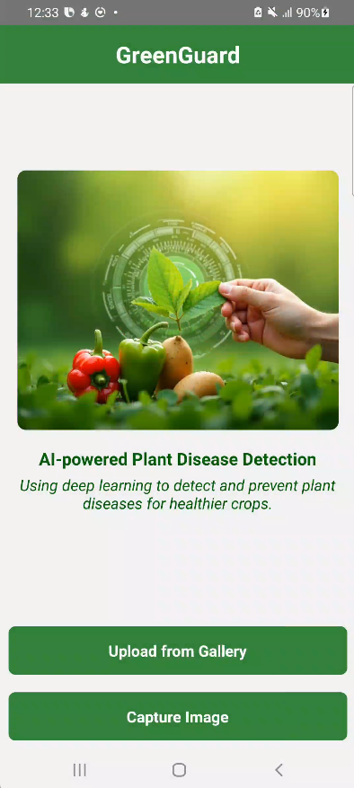

# GreenGuard: AI-Powered Plant Disease Detection

GreenGuard is a mobile application designed to help farmers and gardeners detect and manage plant diseases using deep learning. The app allows users to capture or upload images of leaves, analyzes them with an AI model, and provides disease classification along with treatment recommendations. GreenGuard is built with **React Native** and works **offline** to ensure accessibility in remote agricultural areas.

## Features
- 📷 **Image Capture & Upload**: Take a picture or upload an image of a plant leaf for analysis.
- 🤖 **AI-Based Disease Detection**: Identifies whether the leaf is healthy or affected by diseases such as bacterial spots, blights, or other conditions.
- 🏥 **Treatment Recommendations**: Provides actionable advice for disease management and preventive care.
- 🌐 **Offline Functionality**: Works without an internet connection, making it ideal for use in rural farming areas.
- 📊 **User-Friendly Interface**: Simple and intuitive design for easy navigation.

## Technologies Used
- **React Native** – For cross-platform mobile development.
- **TensorFlow.js / ONNX** – For AI model integration and inference.
- **AsyncStorage** – For offline data storage.
- **React Navigation** – For smooth app navigation.
- **Expo Camera / React Native Image Picker** – For image capturing and selection.

## Installation Guide
Follow these steps to set up the GreenGuard project on your local machine:

1. **Clone the repository:**
   ```sh
   git clone https://github.com/AkinduIB/GreenGuard.git
   cd GreenGuard
   ```
2. **Install dependencies:**
   ```sh
   npm install
   ```
3. **Start the Metro bundler:**
   ```sh
   npm start
   ```
4. **Run the app on Android emulator or a physical device:**
   ```sh
   npm run android
   ```

## Usage
1. **Launch the app** and grant necessary permissions (camera, storage, etc.).
2. **Capture or upload a leaf image** using the provided options.
3. **The AI model analyzes** the image and classifies it as either **Healthy** or **Diseased**.
4. **Receive treatment recommendations** based on the detected disease.

## Screenshots



## AI Model Integration
GreenGuard uses a trained deep learning model to classify plant leaf images. The model was trained on datasets containing images of **potato, bell pepper, and tomato leaves** with different disease conditions.

- The model was converted into **TensorFlow.js / ONNX format** for mobile compatibility.
- It runs **locally on the device**, ensuring **offline functionality**.

## Future Improvements
🔹 Expand the dataset to improve detection accuracy.
🔹 Add support for more plant species and diseases.
🔹 Implement a **community feedback** feature to improve AI predictions.
🔹 Introduce a **plant health tracking system** for monitoring disease progression.

## Credits
Developed by **Your Name** as part of the **GreenGuard** project for plant disease detection.

## License
This project is licensed under the MIT License - see the LICENSE file for details.

---
Feel free to contribute or provide feedback on the project! 🚀

